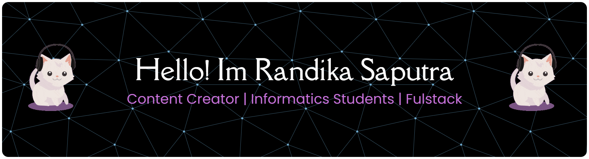

## Hi there I'm Randika Saputra 👋

#### Stats Accounts
<!--               -->

<!-- ##### Connect With Me
    

 
##### Stats

 -->

  
  

###

#### Skills

  
  
  
  
  
  
  
  
  
  
  
  
  
  
  
  
  

##### Connect with me

  
  
  

#### Play with me

